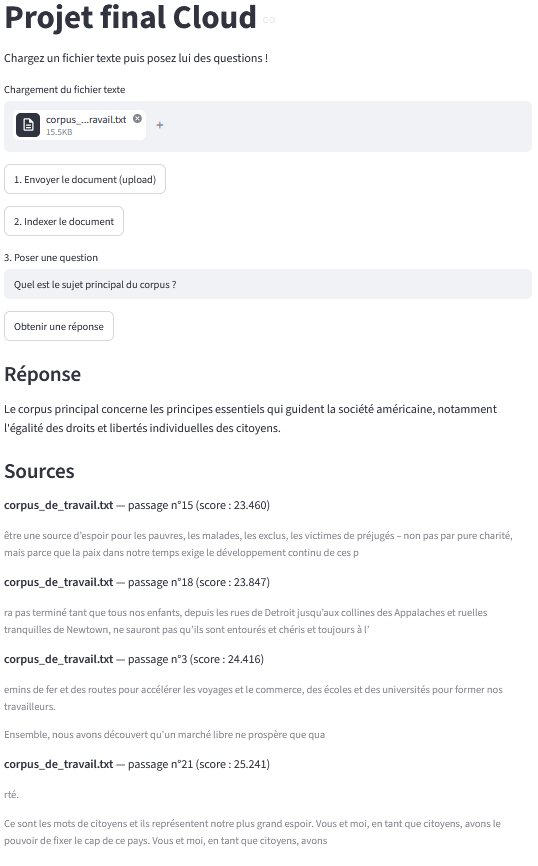

# ProjetCloudRAG

L'objectf du projet est de construire une petite application RAG capable de répondre
à des questions à partir d'un document joint
L'ia ne répond qu'à partir du contenu du document, si elle ne la trouve pas, elle doit
dire explicitement que l'information est absente.


## Interface streamlit

Le projet utilise une petite interface web streamlit qui permet de :
- charger et indexer un document en .txt en une seule action (découpage en chunks +
  calcul d'embeddings + stockage vectoriel) ;
- poser une question à l'ia ;
- obtenir une réponse à partir du document ;
- visualiser les passages exacts du document utilisés comme sources.



Principe d'un RAG :

```
Document -> Découpage en passages -> Embeddings -> Base vectorielle (ChromaDB)
-> Recherche des passages proches -> Prompt enrichi -> Réponse de l'ia + sources
```
## Outils utilisés

| Besoin | Outil |
|---|---|
| Interface utilisateur | Streamlit (`streamlit.py`) |
| Backend API | FastAPI (`backend_api.py`) |
| Stockage du document brut | MinIO (`docker-compose.yml`, `storage_minio.py`) |
| Base vectorielle | ChromaDB (persistant sur disque, dossier `chroma_data/`) |
| Modèle d'embeddings | `sentence-transformers/paraphrase-multilingual-MiniLM-L12-v2` |
| LLM local léger | Ollama avec `qwen2.5:0.5b`, appelé en HTTP |
| Tests | Pytest (`tests/test_basic.py`) |
| Automatisation CI | GitHub Actions (`.github/workflows/cicd.yml`) |

## Installer et lancer Ollama

```
# Installation (Linux/Codespaces)
curl -fsSL https://ollama.com/install.sh | sh

# Démarrer le serveur Ollama
ollama serve

# Télécharger le modèle utilisé par le projet
ollama pull qwen2.5:0.5b

# Test du modèle
ollama run qwen2.5:0.5b
```

## Lancer l'application

1. Installer les dépendances Python :
   ```
   pip install -r requirements.txt
   ```
2. Démarrer MinIO (stockage du document brut) :
   ```
   docker compose up -d
   ```
   Console d'administration disponible sur http://localhost:9001
   (identifiants : `minioadmin` / `minioadmin`).
3. Lancer le backend FastAPI :
   ```
   uvicorn backend_api:app --host 0.0.0.0 --port 8000 --reload
   ```
   Vérifier que l'API répond : `GET http://localhost:8000/health` (ou curl)
4. Lancer l'interface Streamlit depuis un autre terminal :
   ```
   streamlit run streamlit.py --server.port 8501 --server.address 0.0.0.0
   ```
   Ouvrir http://localhost:8501 dans le navigateur.

La configuration est faite dans `conf.env`


Le backend appelle Ollama en HTTP sur `http://localhost:11434/api/generate`
(configurable via `OLLAMA_URL` dans `conf.env`).

## Indexer le document

Dans l'interface Streamlit :

1. Charger `corpus_de_travail.txt`, puis cliquer sur "1. Envoyer et indexer le
   document". Ce bouton envoie le fichier dans MinIO, puis lance immédiatement
   l'indexation : le texte est lu depuis MinIO, découpé en passages de 800
   caractères (chevauchement de 120 caractères), transformé en embeddings, puis
   stocké dans ChromaDB avec ses métadonnées (nom du fichier, numéro de passage).

## Exemple de question

> Que dit le texte sur l'éducation ?
> De quoi parle ce discours ?


Si la question porte sur une information absente du document, l'assistant répond par exemple :
"Je ne trouve pas cette information dans le document fourni."

## Tests et intégration continue

Les tests `pytest` couvrent :
- le découpage du texte en passages (taille et chevauchement respectés) ;
- la construction du prompt envoyé au LLM (présence de la question, du contexte et
  de la consigne de repli) ;
- la disponibilité de l'endpoint `/health`.

Lancer les tests localement :
```
pytest -v
```

Workflow CI/CD dans le repo
